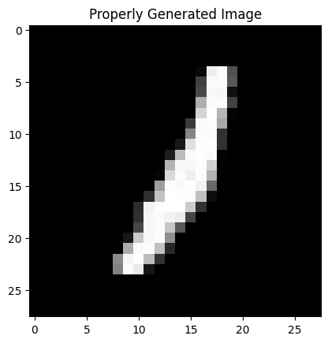

This project implements a simple Denoising Diffusion Probabilistic Model (DDPM) using a U-Net architecture from the Hugging Face Diffusers library to generate handwritten digits from the MNIST dataset.

